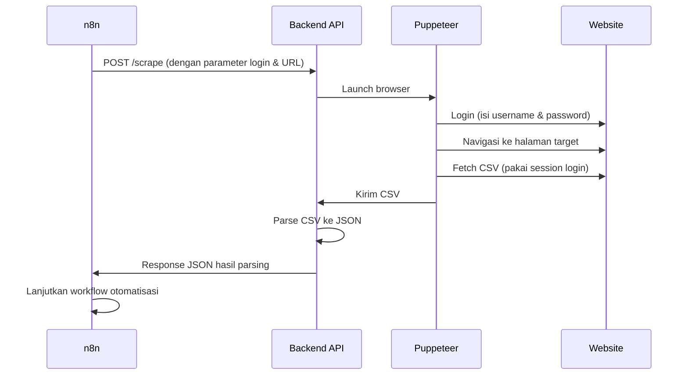

# Backend Scraper Automation with Puppeteer & n8n Integration

## 🚀 Overview
Backend ini adalah **API scraping otomatis** berbasis **Node.js + Puppeteer** yang mampu:
- Login ke website yang memerlukan autentikasi
- Navigasi dan filter data
- Download file CSV secara otomatis
- Parse CSV ke JSON
- Mengirim hasil JSON ke n8n untuk workflow lanjutan

Dirancang **modular, aman, fleksibel**, dan mudah diintegrasikan dengan **n8n** atau sistem lain.

---

## ✨ Features
- **Login otomatis** ke website protected
- **Fetch CSV** dengan session login yang valid
- **Parse CSV ke JSON** secara otomatis
- **API endpoint `/scrape`** yang fleksibel, parameter dikirim via request
- **Proteksi API Key** (opsional, bisa ditambah)
- **Optimasi resource** (block resource tidak perlu, headless mode)
- **Error handling** lengkap
- **Mudah diintegrasikan** dengan n8n

---

## 🏗️ Architecture & Flow



---

## ⚙️ Setup Project

1. **Clone repo ini** ke server Anda
2. **Install dependencies**

```bash
npm install
```

3. **(Opsional)** Buat file `.env` untuk API key, port, dll (tidak wajib, karena parameter dikirim via request)

4. **Jalankan server**

```bash
node app.js
```

Server akan berjalan di port default `3000` atau sesuai `.env`.

---

## 🔥 API Endpoint `/scrape`

### URL

```
POST http://localhost:3000/scrape
```

### Headers

| Key          | Value               |
|--------------|---------------------|
| Content-Type | application/json    |
| x-api-key    | your_api_key (opsi) |

### Body JSON

```json
{
  "loginUrl": "https://yourwebsite.com/login",
  "targetUrl": "https://yourwebsite.com/data",
  "downloadUrl": "https://yourwebsite.com/export.csv",
  "username": "your_username",
  "password": "your_password",
  "filter": "optional_filter",
  "date": "optional_date"
}
```

> **Catatan:** `filter` dan `date` opsional, sesuaikan kebutuhan.

### Response sukses

```json
[
  {
    "column1": "value1",
    "column2": "value2"
  },
  {
    "column1": "value3",
    "column2": "value4"
  }
]
```

### Response error

```json
{
  "error": "Scraping failed",
  "details": "Error message"
}
```

---

## 🤖 Integrasi dengan n8n

- Gunakan node **HTTP Request** di n8n
- Method: **POST**
- URL: `http://your_backend_host:3000/scrape`
- Headers: `Content-Type: application/json`, `x-api-key` (jika pakai)
- Body: JSON sesuai contoh di atas
- Response JSON akan otomatis diteruskan ke node berikutnya di workflow

---

## 📝 Tips & Catatan

- Pastikan selector input username, password, dan dashboard **sudah disesuaikan** dengan website target.
- Jika website pakai captcha atau 2FA, scraping otomatis tidak akan berhasil.
- Gunakan **headless: false** saat debug untuk melihat proses login di browser.
- Pastikan parameter dikirim lengkap via request body.
- Jika login gagal, cek kredensial dan selector.
- Gunakan API key dan rate limit untuk keamanan (opsional).

---

## 🛠️ Troubleshooting

- **Login gagal:** cek kredensial, selector, dan apakah ada captcha.
- **CSV tidak terdownload:** pastikan login sukses dan URL download benar.
- **Response HTML bukan CSV:** biasanya karena session login tidak valid.
- **Parsing error:** pastikan file benar-benar CSV, bukan HTML error page.
- **.env tidak terbaca:** sekarang parameter dikirim via request, `.env` tidak wajib.

---

## 📂 Project Structure

```
/controllers
  scrapeController.js   # Logic scraping & parsing
app.js                 # Setup Express server & routing
.env                   # (Opsional) konfigurasi
.gitignore             # Ignore file
package.json           # Dependencies
README.md              # Dokumentasi ini
```

---

## ❤️ License

MIT

---

## ✨ Happy Scraping & Automation! ✨
