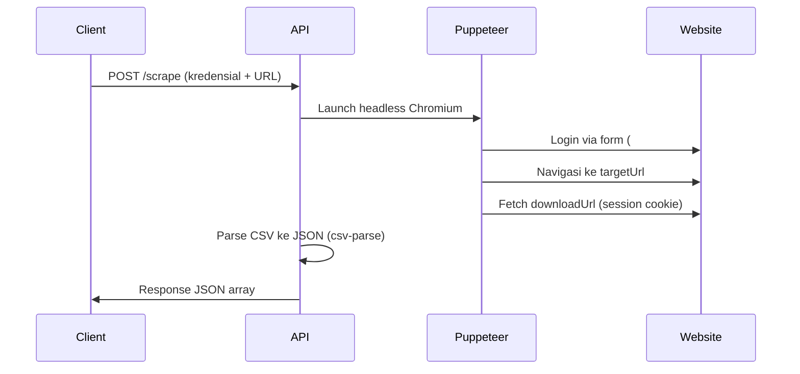

# Scraper Service

REST API berbasis Node.js + Express + Puppeteer untuk mengambil file CSV dari website yang memerlukan autentikasi login, lalu mengembalikannya sebagai JSON. Dirancang sebagai backend untuk workflow otomasi (n8n atau HTTP client lain).

## Arsitektur


```mermaid
sequenceDiagram
    Client->>API: POST /scrape (kredensial + URL)
    API->>Puppeteer: Launch headless Chromium
    Puppeteer->>Website: Login via form (#username, #password)
    Puppeteer->>Website: Navigasi ke targetUrl
    Puppeteer->>Website: Fetch downloadUrl (session cookie)
    API->>API: Parse CSV ke JSON (csv-parse)
    API->>Client: Response JSON array
```

Alur di `controllers/scrapeController.js`:

1. Instance Chromium headless di-launch sekali dan di-reuse antar request (relaunch otomatis jika crash). Tiap request mendapat browser context (incognito) terpisah sehingga session/cookie tidak bocor antar request. Request interception aktif — resource `image`, `stylesheet`, `font`, `media` di-abort untuk mempercepat load dan menghemat memori.
2. Buka `loginUrl`, isi selector `#username` dan `#password`, submit dengan Enter, tunggu navigasi (`networkidle2`).
3. Verifikasi login: URL tidak boleh masih mengandung `/login` dan elemen dashboard harus ada.
4. Navigasi ke `targetUrl`, lalu fetch `downloadUrl` dari dalam konteks page (`credentials: 'include'`) sehingga session cookie ikut terkirim.
5. Validasi konten bukan HTML, parse CSV (`columns: true`, `skip_empty_lines: true`), kirim sebagai JSON.

Browser context selalu ditutup di blok `finally` (termasuk saat error); browser utama tetap hidup untuk request berikutnya. Flag `--disable-dev-shm-usage` dipakai agar Chromium tidak kehabisan shared memory di container Docker (default `/dev/shm` hanya 64 MB).

## Requirement

- Node.js >= 18 (image Docker memakai Node 22 LTS)
- Chromium (otomatis di-download Puppeteer saat `npm install`, atau Chromium sistem via `PUPPETEER_EXECUTABLE_PATH`)

## Konfigurasi

Salin `.env.example` ke `.env` (atau `.env.production` untuk Docker) lalu sesuaikan:

| Variabel  | Wajib | Default | Keterangan                                  |
|-----------|-------|---------|---------------------------------------------|
| `API_KEY` | Ya    | -       | Nilai header `x-api-key` yang diterima      |
| `PORT`    | Tidak | `3002`  | Port HTTP server                            |

Middleware yang aktif di `app.js`:

- **API key** — semua request wajib menyertakan header `x-api-key` yang cocok dengan `API_KEY`; selain itu ditolak `403`.
- **Rate limit** — maksimum 30 request per menit per IP.

## Menjalankan

### Tanpa Docker

```bash
npm install
node app.js
```

### Docker

```bash
docker build -t scraper-service .
docker run -d --name scraper-service \
  --restart unless-stopped \
  -p 3002:3002 \
  --env-file .env.production \
  scraper-service
```

Catatan image:

- Base `node:22-slim` + Chromium dari repositori Debian.
- `PUPPETEER_SKIP_DOWNLOAD=true` — Puppeteer memakai Chromium sistem (`PUPPETEER_EXECUTABLE_PATH=/usr/bin/chromium`), image lebih kecil ±170 MB.
- Proses berjalan langsung via `node app.js`; restart ditangani policy Docker.

## API

### `POST /scrape`

**Headers**

| Header         | Nilai              |
|----------------|--------------------|
| `Content-Type` | `application/json` |
| `x-api-key`    | Sesuai `API_KEY`   |

**Request body**

| Field         | Tipe             | Wajib | Keterangan                                              |
|---------------|------------------|-------|----------------------------------------------------------|
| `loginUrl`    | string           | Ya    | Halaman login website target                              |
| `targetUrl`   | string           | Ya    | Halaman yang dikunjungi setelah login                     |
| `downloadUrl` | string           | Ya    | URL file CSV (di-fetch dengan session login)              |
| `username`    | string           | Ya    | Kredensial login                                          |
| `password`    | string           | Ya    | Kredensial login                                          |
| `filter`      | string \| object | Tidak | Ditambahkan sebagai query param ke `downloadUrl`. String → `?filter=nilai`; object → tiap key jadi param (`{"status":"active"}` → `?status=active`) |
| `date`        | string           | Tidak | Ditambahkan sebagai `?date=nilai` ke `downloadUrl`        |

**Contoh**

```json
{
  "loginUrl": "https://example.com/login",
  "targetUrl": "https://example.com/data",
  "downloadUrl": "https://example.com/export.csv",
  "username": "user",
  "password": "secret",
  "filter": { "status": "active" },
  "date": "2026-07-16"
}
```

**Response**

| Status | Body                                                  | Kondisi                          |
|--------|-------------------------------------------------------|----------------------------------|
| `200`  | `[{ "col1": "val", ... }]`                            | CSV berhasil di-parse             |
| `400`  | `{ "error": "Missing required parameters" }`          | Field wajib tidak lengkap         |
| `403`  | `{ "error": "Forbidden" }`                            | `x-api-key` salah atau tidak ada  |
| `500`  | `{ "error": "Scraping failed", "details": "..." }`    | Login gagal, fetch gagal, dsb.    |

### Integrasi n8n

Gunakan node **HTTP Request**: method `POST`, URL `http://<host>:3002/scrape`, headers dan body seperti di atas. Response JSON langsung diteruskan ke node berikutnya.

## Batasan

- Selector form login (`#username`, `#password`) dan selector verifikasi dashboard **hardcoded** di `controllers/scrapeController.js` — sesuaikan jika website target berbeda.
- Website dengan captcha atau 2FA tidak didukung.

## Troubleshooting

| Gejala                          | Kemungkinan penyebab                                        |
|---------------------------------|-------------------------------------------------------------|
| `Login failed: still on login page` | Kredensial salah, atau selector form tidak cocok        |
| `Login failed: dashboard element not found` | Selector verifikasi tidak sesuai website target  |
| `Downloaded content is HTML, not CSV` | Session tidak valid atau `downloadUrl` salah          |
| Parsing error                   | Konten bukan CSV valid                                       |
| `403 Forbidden`                 | Header `x-api-key` tidak dikirim atau tidak cocok           |

Untuk debug visual, ubah `headless: true` menjadi `false` di `scrapeController.js`.

## Struktur Project

```
app.js                        # Express server, middleware, routing
controllers/
  scrapeController.js         # Logic scraping & parsing CSV
Dockerfile                    # Build image (node:22-slim + Chromium)
.env.example                  # Template konfigurasi environment
.env / .env.production        # Konfigurasi environment (tidak di-commit)
```

## Lisensi

MIT
